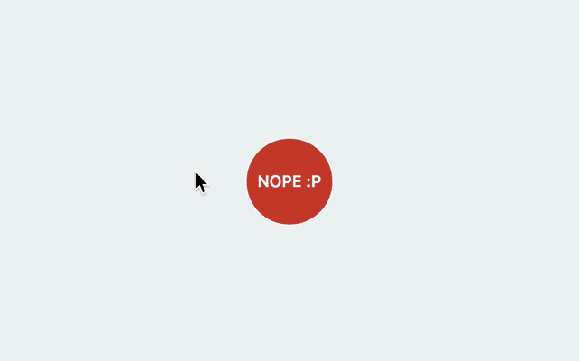

# Control User Cursor.
Small experiment to alter the cursor behavior.

[](http://javier.xyz/control-user-cursor/)

## How it works?
I make the user cursor invisible, and then paint my own cursor with JS! The `:hover` styles are also fake.

Most of the math is here https://github.com/javierbyte/control-user-cursor/blob/master/index.js#L134

## Usage

As this was only planned to be a demo, the current API is kinda rough:

```js
ControlUserCursor({
  el: {
    buttonToPrevent: {
      behavior: 'REPEL',
      el: document.querySelector('.element-to-repel')
    },
    buttonToAttract: {
      behavior: 'ATTRACT',
      el: document.querySelector('.element-to-attract')
    }
  }
});
```

This will replace the real cursor with the fake one and activate the 'repel' and 'attract' behavior on the selected dom elements.

## Roadmap?

I would like to update the API to be like this:

```js
// initiate cursor control
ControlUserCursor()
	.repel('repel', document.querySelector('.el-to-repel'))
	.repel('repel', document.querySelector('.other-el-to-repeal'))
	.attract('attract-buy', document.querySelector('.el-to-attract'));

// stop `document.querySelector('.el-to-repel')` control
controlUserCursor.stop('repel');

// once there all the controls are stopped, the fake cursor disappears
controlUserCursor.stopAll();
```
